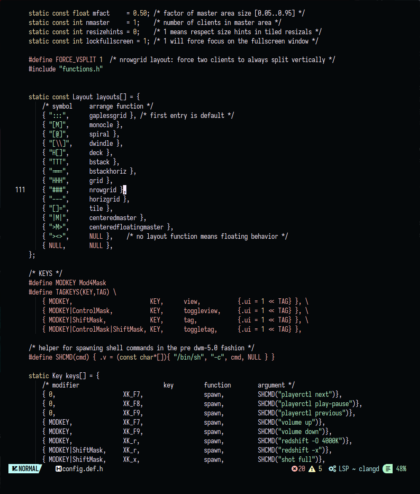

# SAGA for NvChad
A dark theme for [NvChad](https://github.com/NvChad/NvChad).

## Installation
Move SAGA.lua into your NvChad themes folder and set SAGA as your active theme in chadrc.lua. 

## Notes
I don't do a lot of work in neovim so the theme still needs testing and feedback. It is plausible some colours need to have their shades adjusted for better feature visibility. 

## License

[MIT License](./LICENSE)
